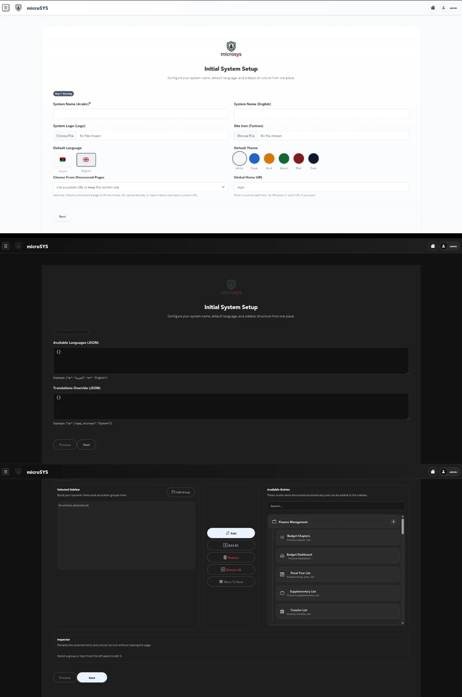
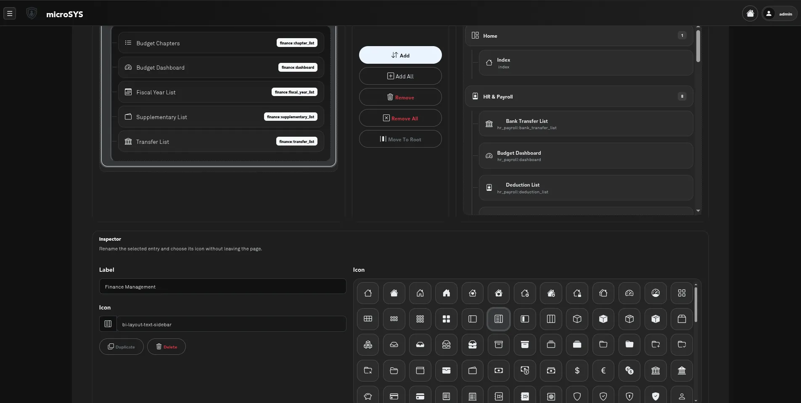
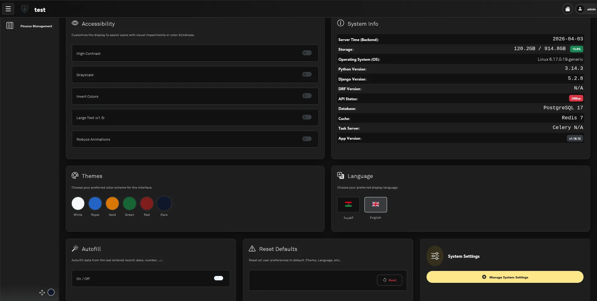

# Admin Guide

This guide is for superusers and operators who configure DjangoLux from the UI after the package is installed.

## How Runtime Configuration Works

DjangoLux stores configuration in three layers:

- framework defaults from the package itself
- project defaults from `settings.DLUX_CONFIG`
- runtime overrides in the `SystemSettings` singleton

User-specific preferences live separately in `Profile.preferences`. That is where theme, language, sidebar state, and autofill choices are persisted.

## First-Launch Setup Wizard

The setup wizard lives at `/sys/setup/` and is only intended for the initial system configuration pass. It is the canonical place to establish the project-wide defaults that later users inherit. On an unconfigured system, `/sys/setup/` first asks for the setup language; choosing either English or Arabic immediately opens the wizard in that language and direction. This choice controls only the first-launch setup UI. The actual app default language is still chosen separately in the Localization step.



The wizard currently runs in eleven steps:

1. Identity
   This step sets language-keyed system names (a JSON dict such as `{"en": "System", "ar": "النظام"}`), logo, and favicon. It also includes the JSON setup import control, which can prefill the wizard from a previously exported Dlux setup file.

2. Localization
   This step manages language-keyed system names, the explicit language catalog, default language, user language override policy, and the translation matrix editor. English and Arabic are built in; custom languages are available to users only after an admin adds them here.

3. Access and security
   This step controls public root access, the global Home URL, the optional split between authenticated Home and anonymous public-root destinations, public registration/email 2FA, Dlux email delivery, and centralized Client IP resolution (auto-detect, direct, header-based, or proxy-aware modes). Use delivery path `Internal SMTP relay` for generated Docker projects where the web service is isolated, or `Direct SMTP from web service` when web has SMTP egress. Secret storage can be environment/secrets or encrypted database.

4. Login Page
   This step controls how the public login screen is presented: the layout **style** (Split, Centered, Minimal, or Full-page split), a **Show Logo** toggle, the **logo treatment** (none / plate / halo / contrast, with plate shape), an optional **banner colour** (any CSS colour; empty = theme default), and — for the Full-page split style only — a per-language Markdown **hero message** shown on the start half beside the form. Settings persist to `SystemSettings.login_config`.

5. Sidebar
   This step manages the sidebar builder and sidebar behavior controls.

6. Nav Bar
   This step manages the optional authenticated Nav Bar, including hierarchy/history mode, user override policy, and the static hierarchy tree. During first-launch setup, enabling an empty Nav Bar tree can seed it from the configured sidebar accordions.

7. UI and Layout
   This step manages titlebar controls (logo/home visibility, logo treatment, action-button shape, Dropdown vs Titlebar Actions user-hub layout, action ordering, alignment, height, and surface style), and the optional titlebar-hide rule for anonymous public home traffic.

8. Notifications
   This step controls the notification subsystem, including the flash, drawer, badge, browser bridge, email delivery, and automatic CRUD notification behavior.

9. Appearance and Typography
   This step manages theme availability, default theme, theme override policy, and the Dynamic Font Management system.

10. Logging
   This step manages user/system activity logging, audit event logging, and retention controls.

11. Profile Page
   This step controls the profile page modules and first-login user setup/onboarding options.

The first-launch page expands to the available page width and hides the runtime sidebar toggle because the runtime sidebar is not rendered during initial setup. Its bullet-style step navigation bar jumps to the corresponding setup step while staying synchronized with the wizard's Next and Previous buttons. The default-language control is save-only: changing it in first-launch setup or later System Settings modals no longer previews the language or reloads the page, and it remains editable independently of the initial setup-language choice.

Useful language/system-name patterns:

```json
{
  "ar": { "name": "العربية", "dir": "rtl", "flag": "🇱🇾" },
  "en": { "name": "English", "dir": "ltr", "flag": "🇬🇧" }
}
```

```json
{
  "en": "System",
  "ar": "النظام",
  "fr": "Systeme"
}
```

The translation matrix shows keys from Dlux and installed app `translations.py` files. It is grouped by source tab, such as Dlux, each installed app, project-level translations, and settings-only override keys. Existing code-level translations prefill cells, but only admin edits are saved into the database override layer.

When the wizard is saved:

- the system is marked configured
- the selected default theme and language become the starting point for new users
- the saved sidebar tree becomes the runtime base sidebar
- optional Nav Bar settings decide whether an authenticated top-of-content trail uses a configured hierarchy or session history
- the chosen home URL becomes the global titlebar Home destination
- the sidebar reorder and toolbar flags become part of the runtime sidebar behavior

Superusers can export the current setup from the Options System Settings card. The downloaded filename uses `dlux-{project-slug}-{YYYY-MM-DD}.json`, where the project slug comes from the deployed project `BASE_DIR` folder name (generic container work-dir names such as `app`, `src`, or `code` are skipped), falling back to the configured English System Settings name when one is set, and finally to `project`. The exported JSON is intended for development and staging workflows where the same setup needs to be reused repeatedly. It includes DB-backed operational settings such as names, language catalog, translation overrides, home URL, optional anonymous public-root URL/split toggle, Client IP resolution config, notifications, login page, sidebar, Nav Bar, titlebar, security toggles, themes, fonts, density defaults, and reserved `extra_config` host data. Logo and favicon are exported as stored file names only; the binary media files are not embedded.

The database stores most of those values in grouped `SystemSettings` JSON fields (`auth_config`, `registration_config`, `public_root_config`, `language_config`, `theme_config`, `typography_config`, `layout_config`, and related UI configs), but exports remain flat and imports accept both flat keys and grouped aliases. The `dlux.system` registry is the canonical internal source for those group constants, defaults, normalizers, legacy aliases, export/import field coverage, and simple scalar form packing. The `dlux.models.default_*_config` wrappers must remain importable because published migrations `0001`/`0002` serialize those callable paths. Translation exports include only `translations_override` edits, not the full merged translation catalog.

On a fresh, unconfigured project, Dlux also checks `BASE_DIR/config.json` when `/sys/setup/` is opened by a superuser. A valid exported payload or direct settings dict is applied once, marks setup complete, and redirects to the configured home URL. Invalid JSON is ignored with a setup warning, and already configured systems never treat `config.json` as a live settings layer.

## Sidebar Builder and Runtime Navigation

The sidebar builder is not just a setup-only toy. It feeds the actual runtime sidebar tree, so the structure you save is what users start from.



Important behaviors:

- the builder uses discovered URLs instead of old suffix-only assumptions
- hidden dlux, Django admin, and health-check routes are excluded from the public navigation catalog
- **sidebar items are only visible to users who have the required view permission** — there is no implicit staff access; each item's permission is inferred from the model, URL pattern, or explicit decorator
- icons, labels, and grouping can be curated in the inspector
- the global Home URL is now independent from sidebar structure
- runtime user reordering works as a personal override layered on top of the system base tree when reorder is enabled
- the sidebar toolbar can be disabled entirely if a project does not want the runtime theme picker and reorder entrypoint in the sidebar footer
- the built-in Dynamic Sections Manager shortcut lives in that toolbar; if you disable it and still want UI access, expose the relevant Dlux system item inside the sidebar tree instead
- the runtime sidebar now uses one shared flat rail layout across themes, while each theme can still supply its own accent colors, active states, and toolbar styling without changing the geometry

Operationally, that means you can keep a carefully curated default navigation while still letting users personalize their own ordering later.

## Optional Nav Bar

Step 5 owns the optional authenticated Nav Bar. When enabled, it appears above page content beside the sidebar and uses the same translated UI layer as the rest of Dlux.

- **Hierarchy** uses the visual Step 5 tree editor. Discovered routes provide translated labels, and manual grouping nodes can add non-clickable labels or URL-backed shared ancestors.
- **History** keeps one six-entry recent trail in the current browser session, deduplicates repeated paths without treating filters, sorting, or pagination query strings as new pages, and resolves known route labels in the active interface language.
- **User override** is available in Options only when the developer allows it. Otherwise the developer-selected default style stays authoritative.
- Dlux-owned system views are not manually placed from the hierarchy builder; they are automatically grouped under an unclickable `System` crumb when accessible.

Dynamic object and tab pages can supply a `dlux_navbar_crumbs` runtime context list when their labels cannot be modeled by the static hierarchy tree. Runtime crumbs take precedence over the stored tree; unconfigured pages fall back to a translated Root and current-view pair.

## Themes and the Shared Theme Registry

DjangoLux now keeps its official theme list in one shared registry. That registry drives:

- setup and System Settings theme choices
- runtime theme validation and fallback behavior
- sidebar theme-picker ordering and preview swatches
- base-template theme stylesheet inclusion

Operationally, that means theme additions should be treated as framework-level changes rather than one-off CSS drops. If a theme exists in the official registry, it should appear consistently across setup, options, and the live runtime UI.

The current official order is:

- `light`
- `blue`
- `gold`
- `green`
- `red`
- `mono`
- `dark`
- `gothic`
- `retro`
- `neon`

## Typography and Font Management

DjangoLux features a centralized, dynamic Font Management system that allows admins to control the typography across the entire application without modifying CSS.

### Font Registry

The system maintains a registry of approved fonts located in `dlux/fonts.py`. These fonts are hosted locally under `static/dlux/fonts/`, ensuring the system remains functional in offline or air-gapped environments.

### Admin Controls

From the **Appearance and Typography** setup step (or the corresponding System Settings modal), admins can:

- **Theme Matrix**: Each theme card shows a checkbox and a visual preview circle. Click the large preview circle to make a theme the default. Click the rest of the card, or the checkbox inside it, to allow or disable that theme for runtime user selection. The active card and preview-ring styling identify the default theme.
- **Allowed Fonts**: Select which fonts from the registry are available for use in the system.
- **Default Fonts per Language**: Assign a specific default font for each active language (e.g., a specific font for Arabic and another for English).
- **Allow User Overrides**: Decide if individual users can choose their own preferred font from the allowed list in their Options panel.

### Technical implementation notes:

- **FOUC Prevention**: The system includes early-load logic in `base_head.js` to inject the selected font CSS variable (`--dlux-main-font`) before the page renders, preventing "Flash of Unstyled Content".
- **Global Control**: The entire UI honors the `--dlux-main-font` variable for typography consistency.

## Options View

After first launch, day-to-day configuration continues in `/sys/options/`.



The Options screen currently provides:

- accessibility toggles such as high contrast, grayscale, invert, large text, and reduced animations
- privileged system information such as server time, storage usage, Python version, Django version, DRF version, and the current app version
- theme switching
- language switching
- typography/font switching (if allowed by admin)
- table-density switching for the current user
- autofill enable or disable
- reset-to-defaults for user preferences
- a superuser-only System Settings button that opens focused Branding, Languages, Access & Security, Login Page, Sidebar, Nav Bar, UI & Layout, and Appearance modals
- a superuser-only setup export action for reusing System Settings across development environments
- a superuser-only Backup & Restore card that summarizes the latest full backup, completed/protected backup counts, and latest restore before opening `/sys/backup/`

Options layout note:

- the cards are intentionally reorganizable from their drag handles
- card order persists per browser in local storage, not in `Profile.preferences`
- the System Info card intentionally stays wider than the rest of the cards inside the grid

Security note:

- the diagnostics card is now staff/superuser-only
- ordinary authenticated users still keep their personal preference controls in Options

Operational note:

- dark themes are expected to skin both the language picker and theme-preview selectors on this page so inactive choices do not fall back to light/white treatment

That means the setup wizard is for initial onboarding, while the Options view is the ongoing operational hub.

## Detailed Configuration Instructions

### Client IP Resolution Modes

Admins can configure how DjangoLux identifies the client IP address in Step 3 (Access and Security). This is critical for accurate activity logging and security tracking.

- **Auto-detect** (recommended default): Tries sources in priority order — `X-Forwarded-For` (leftmost) → `X-Real-IP` → `CF-Connecting-IP` → `REMOTE_ADDR` — and uses the first non-empty value. Sensible for most deployments without manual tuning.
- **Direct**: Use `REMOTE_ADDR` directly. This is the correct choice if the web server is facing the internet directly without a proxy.
- **Proxy-Aware (X-Forwarded-For)**: Parses the `HTTP_X_FORWARDED_FOR` header. Use this if the application is behind a standard reverse proxy (like Nginx or HAProxy). You can specify the number of **Trusted Proxy Hops** to ignore from the right.
- **Custom Header**: Use a specific header provided by your infrastructure (e.g., `HTTP_CF_CONNECTING_IP` for Cloudflare).

All modes share a hardened fallback: if the configured source returns nothing, DjangoLux still tries `X-Forwarded-For` (leftmost) → `X-Real-IP` → `REMOTE_ADDR` before giving up, so a misconfigured header no longer yields an empty client IP.

### Two-Factor Authentication (2FA) & Trusted Devices

DjangoLux provides multiple layers of authentication security.

- **Email 2FA**: If enabled, the system will send a one-time password (OTP) to the user's registered email during login. Admins must ensure a working **Email Delivery Path** is configured.
- **Authenticator App (TOTP)**: Users can link an app like Google Authenticator for code-based 2FA.
- **Trusted Devices**: During 2FA verification, users can check "Trust this device for 30 days", and users may also trust the current browser from the Profile **Signed-in Devices** card after confirming their password.
    - Trusted sessions take precedence over untrusted sessions. An untrusted current session cannot sign out a trusted session from Profile.
    - Step 3 / Access & Security includes **Prevent multiple active sessions**. When enabled, a newly trusted session signs out every other active session for the same user.
    - Revoking a device trust forces the user to complete a 2FA challenge on their next login from that browser, and revoking a session immediately logs the user out from that device.

## Themes, Languages, and Home URL

The most common admin-facing configuration tasks are:

- changing the default theme used before a user saves a personal preference
- changing the default language used before a user saves a personal preference
- changing the default table density used before a user saves a personal preference
- updating the list of available languages
- adding translation overrides without touching code
- adjusting the global home URL used by the titlebar Home button
- optionally routing anonymous public-root traffic to a different destination from the authenticated Home URL

The safest mental model is:

- use `DLUX_CONFIG` to seed defaults in code
- use System Settings to refine the live runtime configuration
- use user preferences for per-user display choices

## Tutorial and User-Facing Runtime Behavior

DjangoLux includes a built-in tutorial system that targets the current view path. Users may see different guided steps on `/sys/`, `/sys/users/`, `/sys/sections/`, and other supported pages.

Project-specific tutorial additions should extend this built-in system rather than replace it. The intended developer path is to load a project script through `templates/dlux/includes/custom_scripts.html` and register `window.get_custom_tutorial_steps(path)`. See the customization guide for the supported extension pattern.

Other admin-facing runtime behaviors to expect:

- user management uses the interactive two-step modal wizard
- permission labels are translated dynamically
- profile pages expose 2FA controls and backup-code workflows
- activity logs show diffs and download/export context
- user rows expose a sensitive User Report for authorized staff with activity-log access

2FA operational note:

- enable, disable, backup-code generation, TOTP setup, and OTP resend flows are now POST-backed actions rather than GET-triggered links
- email 2FA supports background auto-sending on login and enforces a 120s resend cooldown
- destructive profile security actions now ask for the current password before the backend mutation is allowed to proceed
- sessions can be marked as "Trusted" for 30 days during 2FA verification to skip subsequent challenges on the same browser
- when single active session enforcement is enabled, every successful login or completed 2FA login evicts the user's other active sessions, including cache/Redis-backed sessions once Dlux has recorded their presence; older browsers see the session-ended page on their next request

## Activity Logs in Daily Use

The activity log screen lives at `/sys/logs/` and is intended to be an operational audit surface, not just a developer debug page.

What admins and staff can expect to see there:

- CRUD events captured from signal-driven model saves and deletes
- login and logout events
- merged User/Profile updates recorded as one logical "User Profile" history stream
- masked sensitive fields such as passwords and backup codes
- download and export activity coming from the universal fetcher and Excel exporter
- scope-aware visibility for staff who should not see every system-wide action

The detail modal resolves the related object when possible, so an audit row can often be traced back to the underlying model instance instead of staying as a dead log record.

## User Reports

The User Report is available from `/sys/users/` for authorized staff who can view the user directory, manage the target user, and view activity logs. It opens in a Dlux dynamic modal, can be printed or saved as PDF through the browser print flow, and can be exported as XLSX.

The report combines account status, staff tier, public-registration provenance, activity counts, recent logs, known devices, trusted-device state, IP observations, browser/OS observations, and estimated active time. Precise device and presence analytics start only after the durable history migration is installed; older projects still show whatever can be derived from existing activity logs and trusted-device rows.

Dlux uses a signed first-party `dlux_device_id` cookie to group non-trusted browser/device history across IP changes. The raw token is never exposed in the UI and is stored server-side only as a hash. This cookie is for reporting continuity only; Django sessions remain authoritative for active authentication, and `TrustedDevice` remains authoritative for 2FA trust decisions.

## System Reports and Backup ZIP

The reports overview at `/sys/reports/` (permission `dlux.view_reports`) aggregates report-eligible activity by user, model, action, and day for a `week`, `month`, or `all` window, and exports the same overview as XLSX. The overview performs grouped database aggregates rather than loading every activity row into Python, and migration `0013_useractivitylog_report_indexes` adds indexes for the timestamp, scope, actor, model, and action filters used by the page.

Celery is reserved for building large downloadable backup files; it is not used for the interactive overview request. Redis is useful as Django's shared cache: set `DLUX_CONFIG['reports']['overview_cache_seconds']` to a small positive TTL (for example `30`) to cache only the aggregate/dropdown portion of the overview per viewer, scope, language, window, and filter set. The default is `0`, which disables this cache and keeps every page load fully current.

This feature is built for the **application supervisor**: monitoring what users input over time and keeping periodic, incremental, window-scoped data exports. It is intentionally scoped/windowed and is **not** a disaster-recovery tool — for full restorable snapshots use the Full System Backup & Restore feature below.

Staff with `dlux.download_backup` can also generate a backup ZIP containing serialized JSON for every report-eligible model plus the files referenced by their `FileField`/`ImageField` columns, with a `manifest.json` describing the contents. The backup honors the selected report window: each model is filtered on its timestamp column (auto-detected `created_at`/`created`/`created_on`/`date_created`/`timestamp`, overridable per model via `DLUX_CONFIG['reports']['backup_window_fields'] = {'app.model': 'field_name'}`; models with no timestamp column are always included in full).

Backup generation flow:

- Clicking the backup button POSTs to `/sys/reports/backup/start/`. When Celery is importable, the broker is reachable, and a live worker answers a ping, the build is queued as a `dlux.tasks.build_report_backup` task and tracked in the `ReportBackup` model; the page polls `/sys/reports/backup/<token>/status/` and triggers the download from `/sys/reports/backup/<token>/download/` when the row reaches `completed`. This avoids reverse-proxy timeouts (e.g. nginx 504) on large datasets.
- Without a usable Celery worker, the client is redirected to the synchronous `/sys/reports/backup.zip?window=<window>` endpoint, which streams the zip from a temp file (constant memory) but remains subject to proxy timeouts on very large `all` backups.
- Status/result hand-off needs only a shared database plus shared default storage between web and worker. Generated zips are stored under `MEDIA_ROOT/dlux_backups/` (prefix configurable via `DLUX_CONFIG['reports']['backup_storage_prefix']`); the last 3 completed backups per user are retained, older ones are pruned automatically. Set `DLUX_CONFIG['reports']['backup_use_celery'] = False` to force the synchronous path.

**Deployment requirement:** the backup prefix lives under media so containers can share it, but it must never be served directly. Block it at the reverse proxy, e.g. nginx:

```nginx
location /media/dlux_backups/ {
    deny all;
}
```

Downloads always go through the permission-checked Django view, which also enforces that only the requesting user can fetch their own backup. Dlux-owned transactional SMTP mail (OTP codes, registration, backup-related notifications) now applies a connection timeout (default 10s, override with `email_config['timeout']`) so an unreachable mail host fails fast instead of hanging the request.

## Full System Backup & Restore (.dlb)

`/sys/backup/` (superuser only) creates complete, encrypted, restorable snapshots — distinct from the supervisor reports backup above. A full backup always covers **everything for all time**: every concrete managed model (users, regular-user password hashes, groups, scopes, profiles, system settings, activity history, host-app data) plus every referenced storage file, packaged as a single `.dlb` file. Superuser account rows are included, but superuser password hashes are omitted from the backup payload.

**File format and encryption.** An `.dlb` file is a `DLB1`-tagged container: a cleartext JSON metadata header (format version, creation date, row/file counts, KDF salt, KDF mode — nothing sensitive) followed by the backup zip encrypted with Fernet (`cryptography`) in framed 32MB chunks, so any size encrypts and decrypts at constant memory. By default the key derives from Django `SECRET_KEY` plus the per-file salt. When the superuser enters an optional backup passphrase, the key derives from that passphrase instead; restoring that file requires the same passphrase and does not depend on a separate backup-specific environment variable.

**Creating and managing backups.** The page builds backups in the background through Celery (`dlux.tasks.build_system_backup`) with polling, or inline when no worker is available. The optional passphrase is passed only to the active inline run or Celery task; it is not stored on the `SystemBackup` row. Completed backups can be downloaded, deleted, or restored. `.dlb` files can also be uploaded (small files) or copied directly into the protected backup folder (`MEDIA_ROOT/dlux_backups/` by default — keep the reverse-proxy `deny all` rule from the reports-backup section); the page lists such external files and can restore from them, which is the path for disaster recovery onto a rebuilt server.

**Restore semantics.** Restore is a **full replace**: it wipes and reloads every backed-up model in a single transaction (FK checks deferred, models loaded in dependency order, Dlux signals suspended), resets primary-key sequences, restores files to their original storage names, then clears all caches and sessions. The backup manifest records the exact applied-migration state; restore refuses to run against a different migration state unless "ignore version mismatch" is explicitly checked. Starting a restore requires the superuser's current password plus an explicit replace confirmation, and passphrase-protected files also require the backup passphrase. Regular users sign in with the restored credentials. For superusers, Dlux preserves the current target password hash when the restored superuser username matches an existing target superuser; restored superusers without a target username match receive an unusable password and must be reset out-of-band.

Config knobs under `DLUX_CONFIG['backup']`: `use_celery` (default `True`) and `exclude_models` (extra `app_label.model` strings to omit from snapshots).

**Inspecting a backup offline.** A standalone, read-only viewer for `.dlb` files ships in the repo at [`tools/dlb-viewer/`](../tools/dlb-viewer/README.md). It is a single, dependency-free cross-platform binary (Go) that decrypts a backup locally and opens a small browser UI to browse the manifest, every model's serialized rows, the recorded migration state, and any stored files — without a running Dlux instance. On entry it prompts for the backup passphrase, or the originating project's Django `SECRET_KEY` when the file was not passphrase-protected (the cleartext header records which is needed). Prebuilt binaries are attached to each GitHub release; it can also be built with `make` from that directory. Use it to confirm a `.dlb`'s contents before restoring, or to recover specific records/files from a snapshot.

## User Preferences

User preferences are stored in `Profile.preferences` and updated through the Preferences API. Common keys include:

- `theme`
- `lang`
- `table_density`
- `table_page_size`
- `font`
- `sidebar_collapsed`
- `sidebar_accordions`
- `sidebar_order`
- `autofill_enabled`

Resetting preferences from the Options screen clears both the stored preference payload and the related session keys.

## Staff Authorization Tiers

DjangoLux distinguishes three staff authorization tiers for user management:

| Tier | Scope | Requirements | User Management Powers |
|------|-------|--------------|------------------------|
| **Superuser** | None | `is_superuser=True` | Full god mode — create, edit, delete any user including other superusers |
| **Global Staff** | None (NULL) | `is_staff=True` + `dlux.manage_scopes` permission | Create/manage scopes, assign users to any scope, view and edit ALL users (scoped and scopeless) |
| **Central Staff** | None (NULL) | `is_staff=True` (NO `manage_scopes`) | Create/manage scopeless (NULL scope) users ONLY — completely blind to scoped users and their data |
| **Scoped Staff** | Assigned scope | `is_staff=True` + scope assignment | Create/manage users within their assigned scope only |

The Add User form also includes **Require password change on first login**. It is off by default; when selected, Dlux stores `force_password_change` in the new user's profile preferences and middleware redirects that account to the profile password-change form until the password is changed. If Initial User Setup is also enabled for the account, Dlux defers that onboarding modal until after the password requirement is cleared. Profile password changes and staff reset-password submissions are rejected when the new password is identical to the account's current password.

### Creating Global Staff

Only **superusers** can create Global Staff users. To create a Global Staff member:

1. Sign in as superuser
2. Go to `/sys/users/` → Add User
3. Check **Staff Status**
4. In Permissions, select **"Can manage scopes and all users"** (`dlux.manage_scopes`)
5. Leave **Scope** empty (NULL)

Global Staff can then:
- Create and manage scopes
- Create users in any scope (or scopeless)
- View and edit ALL users regardless of scope
- Assign scopes to existing users

### Creating Central Staff

**Global Staff** or **superusers** can create Central Staff. To create a Central Staff member:

1. Sign in as Global Staff or superuser
2. Go to `/sys/users/` → Add User
3. Check **Staff Status**
4. In Permissions, select `dlux.manage_staff` (but NOT `dlux.manage_scopes`)
5. Leave **Scope** empty (NULL)

Central Staff can then:
- Create and manage scopeless users only
- Cannot see scoped users in the user list
- Cannot assign scopes to any user
- Cannot access scope management

### Creating Scoped Staff

Any staff member with `manage_staff` permission can create Scoped Staff. To create a Scoped Staff member:

1. Sign in as staff with `manage_staff` permission
2. Go to `/sys/users/` → Add User
3. Check **Staff Status**
4. Select a **Scope** for the user
5. The new user will only be able to manage other users in that same scope

This tier system ensures that:
- Scoped users have privacy from Central Staff
- Central Staff can handle routine user management for the core system without accessing private scoped data
- Global Staff can administer the entire multi-tenant system without needing full superuser privileges

### Permission Assignment Principle

**Users can only assign permissions they themselves have.** This is enforced at the form level:

- Non-superusers see ONLY the permissions they have been granted (directly or through groups)
- `manage_staff` permission can only be assigned by users who have it
- `manage_scopes` permission can only be assigned by superusers (who can create Global Staff)
- `view_activitylog` permission can only be assigned by users who have it

The grouped permission cards show localized descriptions for Dlux-owned permissions such as reports, report backups, sections, activity logs, and staff access so administrators can see what each grant unlocks before assigning it.

This prevents privilege escalation where a user could grant themselves or others permissions they don't possess.
