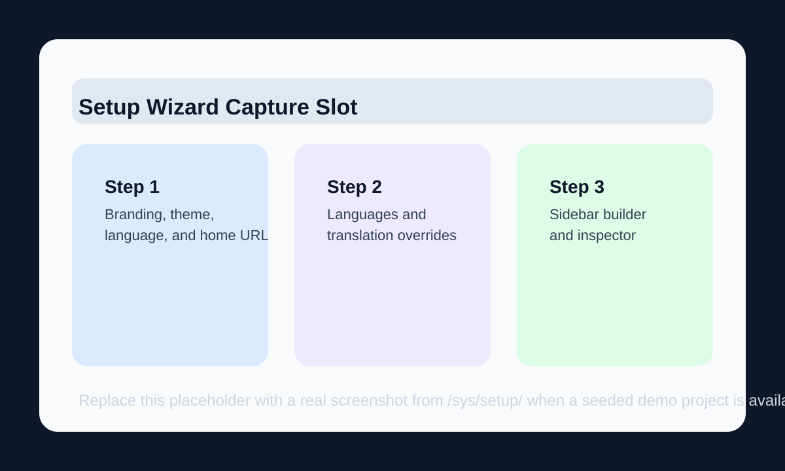
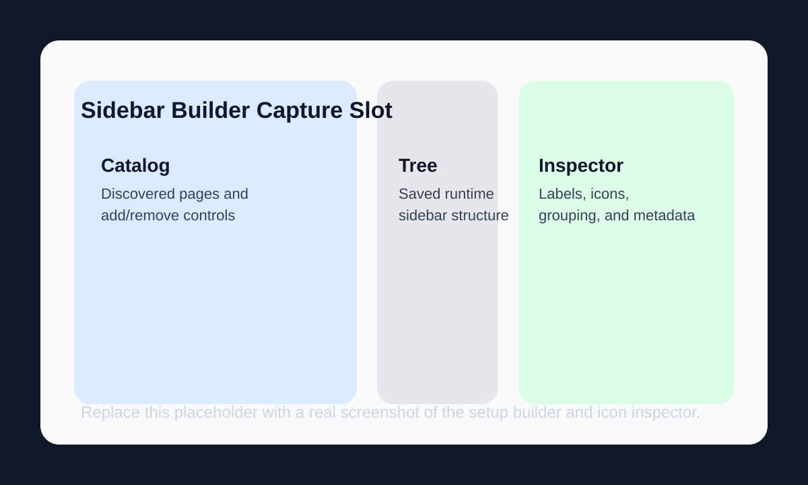
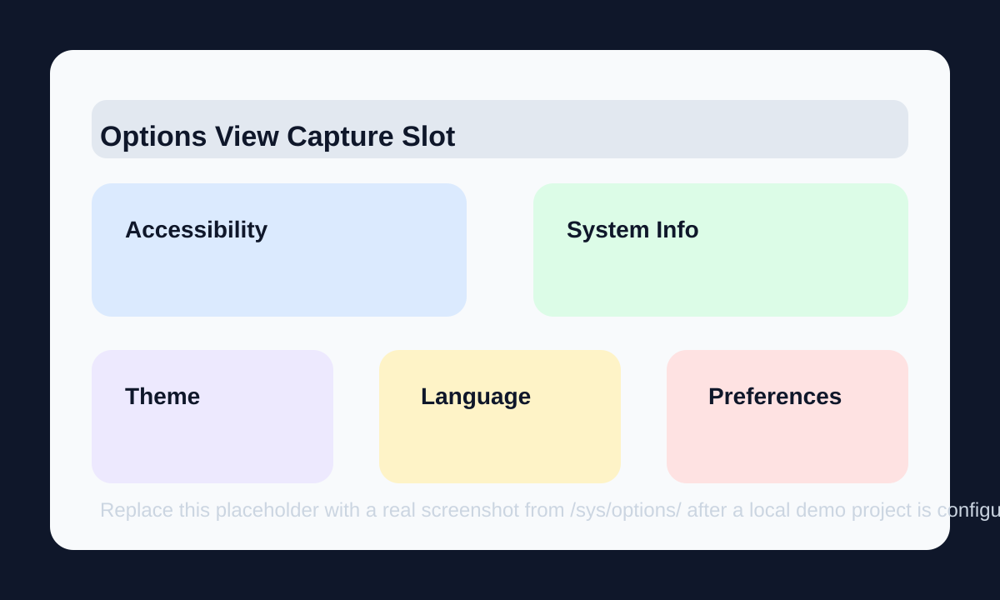

# Admin Guide

This guide is for superusers and operators who configure microSYS from the UI after the package is installed.

## How Runtime Configuration Works

microSYS stores configuration in three layers:

- framework defaults from the package itself
- project defaults from `settings.MICROSYS_CONFIG`
- runtime overrides in the `SystemSettings` singleton

User-specific preferences live separately in `Profile.preferences`. That is where theme, language, sidebar state, and autofill choices are persisted.

## First-Launch Setup Wizard

The setup wizard lives at `/sys/setup/` and is only intended for the initial system configuration pass. It is the canonical place to establish the project-wide defaults that later users inherit.



The wizard currently runs in three steps:

1. Branding and defaults
   This step sets the Arabic and English system names, logo, favicon, default language, default theme, and the global home URL. The home URL can come from discovered pages or a typed custom path.

2. Language catalog and translation overrides
   This step manages the available languages JSON and the translation-override JSON.

3. Sidebar structure
   This step uses the sidebar builder to assemble the default navigation tree that the runtime UI will render.

Useful JSON patterns:

```json
{
  "ar": { "name": "العربية", "dir": "rtl", "flag": "🇱🇾" },
  "en": { "name": "English", "dir": "ltr", "flag": "🇬🇧" }
}
```

```json
{
  "en": { "app_microsys": "System" },
  "ar": { "app_microsys": "النظام" }
}
```

When the wizard is saved:

- the system is marked configured
- the selected default theme and language become the starting point for new users
- the saved sidebar tree becomes the runtime base sidebar
- the chosen home URL becomes the global titlebar Home destination

## Sidebar Builder and Runtime Navigation

The sidebar builder is not just a setup-only toy. It feeds the actual runtime sidebar tree, so the structure you save is what users start from.



Important behaviors:

- the builder uses discovered URLs instead of old suffix-only assumptions
- hidden microsys, Django admin, and health-check routes are excluded from the public navigation catalog
- icons, labels, and grouping can be curated in the inspector
- the global Home URL is now independent from sidebar structure
- runtime user reordering works as a personal override layered on top of the system base tree

Operationally, that means you can keep a carefully curated default navigation while still letting users personalize their own ordering later.

## Options View

After first launch, day-to-day configuration continues in `/sys/options/`.



The Options screen currently provides:

- accessibility toggles such as high contrast, grayscale, invert, large text, and reduced animations
- system information such as server time, storage usage, Python version, Django version, DRF version, and the current app version
- theme switching
- language switching
- autofill enable or disable
- reset-to-defaults for user preferences
- a superuser-only System Settings button that opens the editable settings modal

That means the setup wizard is for initial onboarding, while the Options view is the ongoing operational hub.

## Themes, Languages, and Home URL

The most common admin-facing configuration tasks are:

- changing the default theme used before a user saves a personal preference
- changing the default language used before a user saves a personal preference
- updating the list of available languages
- adding translation overrides without touching code
- adjusting the global home URL used by the titlebar Home button

The safest mental model is:

- use `MICROSYS_CONFIG` to seed defaults in code
- use System Settings to refine the live runtime configuration
- use user preferences for per-user display choices

## Tutorial and User-Facing Runtime Behavior

microSYS includes a built-in tutorial system that targets the current view path. Users may see different guided steps on `/sys/`, `/sys/users/`, `/sys/sections/`, and other supported pages.

Other admin-facing runtime behaviors to expect:

- user management uses the interactive two-step modal wizard
- permission labels are translated dynamically
- profile pages expose 2FA controls and backup-code workflows
- activity logs show diffs and download/export context

## User Preferences

User preferences are stored in `Profile.preferences` and updated through the Preferences API. Common keys include:

- `theme`
- `lang`
- `sidebar_collapsed`
- `sidebar_accordions`
- `sidebar_order`
- `autofill_enabled`

Resetting preferences from the Options screen clears both the stored preference payload and the related session keys.

## Screenshot Assets

The visual assets for this guide live in [`docs/assets/`](assets/README.md). The current files are lightweight placeholders so the docs already have stable image targets before real seeded-project captures are committed.
